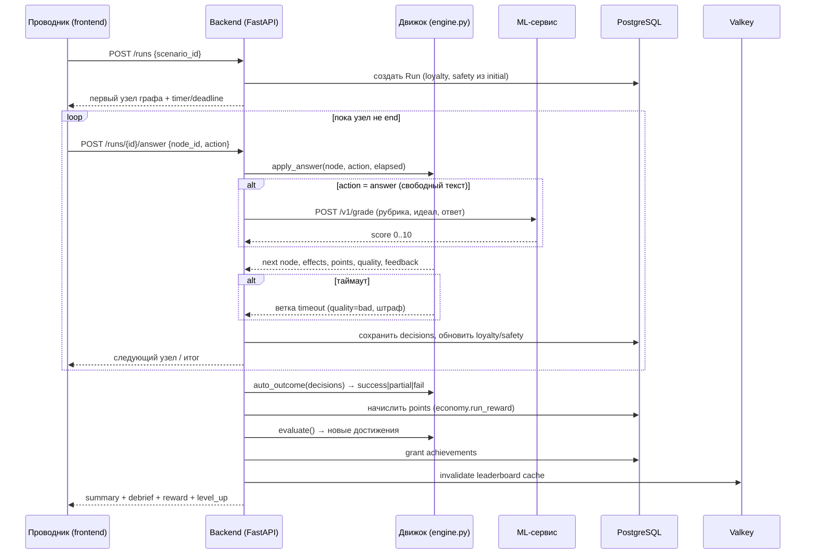
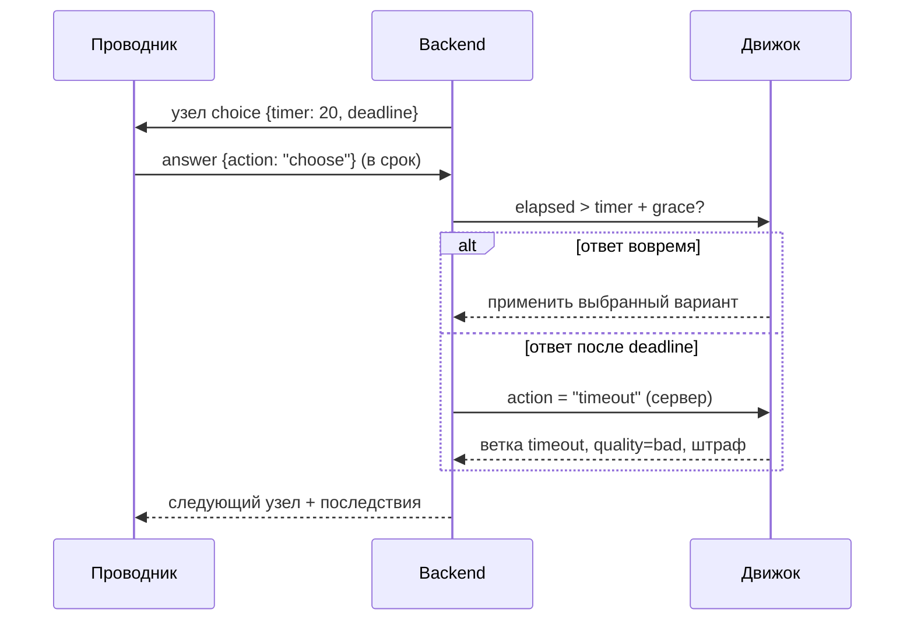
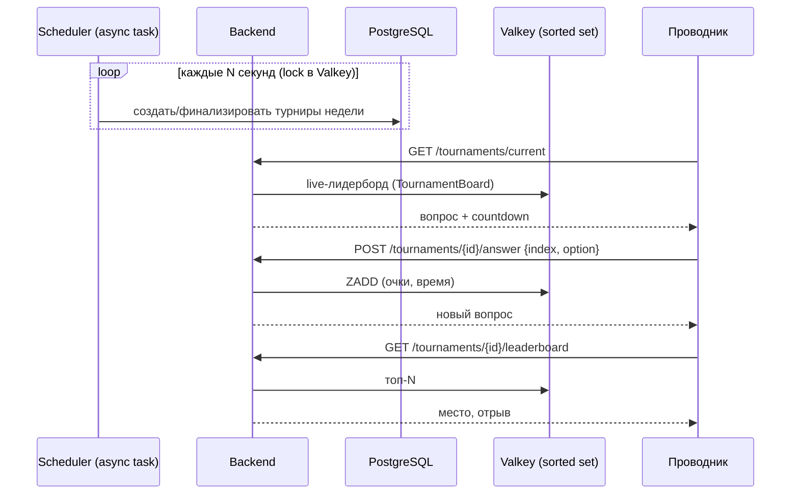
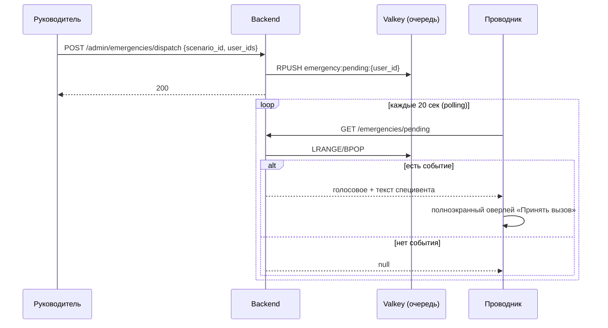
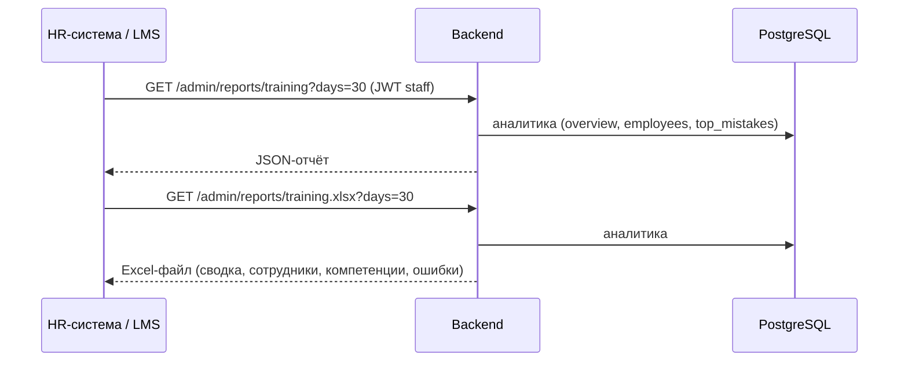

# Архитектура

```
user ──► nginx ──► frontend (React + TS, web view)
           │
           └──/api──► backend (FastAPI) ──► PostgreSQL   (источник истины)
                          │   │  │      ──► Valkey       (живые лидерборды, кэш, очередь специвентов, rate limit)
                          │   │  └──────► ml service   (оценка ответов, черновики сценариев, ассистент)
                          │   │                 └──► GigaChat API | Ollama (Qwen 2.5, локально) | эвристика
                          │   └──/metrics──► Prometheus ──┐
                          │                                ├──► Grafana (дашборды)
    логи всех контейнеров ──► Alloy ──► Loki ──────────────┘
                          └────────────────► (S3 — следующий этап)
```

## Backend: три слоя

Упрощённая чистая архитектура под MVP. Зависимости направлены внутрь: фреймворки → бизнес-логика ← репозитории.

```
backend/app/
├── business/              # бизнес-логика
│   ├── engine.py          # движок нелинейных сценариев (чистые функции, без БД и HTTP)
│   ├── economy.py         # очки компетенций, уровни, награды турнира
│   ├── achievements.py    # каталог ачивок и правила выдачи
│   ├── adaptation.py      # адаптивный подбор сценария по слабым местам
│   ├── tournament.py      # расписание турнира, выбор вопросов
│   ├── catalog.py         # должности, категории, режимы (обучение / повышение квалификации)
│   └── services/          # сценарии использования: play, tournaments, emergencies, analytics, admin…
├── repositories/          # доступ к данным
│   ├── models.py          # ORM-модели SQLAlchemy
│   ├── users.py, runs.py, scenarios.py, points.py, tournaments.py, achievements.py, analytics.py
│   ├── cache.py           # Valkey: лидерборд турнира, кэш, очередь специвентов, rate limit
│   └── ml_gateway.py      # HTTP-клиент ML-сервиса
├── frameworks/            # FastAPI, конфиг, БД, JWT, Prometheus
│   └── api/               # роутеры, схемы запросов, зависимости
└── seed/                  # контент сценариев и демо-данные
```

Движок сценариев намеренно чистый: его покрывают юнит-тесты, и на нём же генерируется демо-история (симулированные сотрудники реально проходят графы).

## Ключевые решения

* **Сервер решает, сколько прошло времени.** В каждом шаге с таймером есть `deadline` и `server_now`. Если ответ пришёл после дедлайна (с запасом на сеть), он засчитывается как таймаут. Досрочный «таймаут» отклоняется.
* **Сценарий — это JSON-граф** (`scene | choice | input | end`). Новые сценарии добавляются без деплоя: через админку, вручную или из черновика ИИ.
* **Ход сценария зависит от ответов.** Каждый вариант ведёт в свой узел, у таймера может быть своя ветка, свободный ответ ветвится по оценке ИИ (`branches`), а условные переходы `routes` смотрят на шкалы и на ранее выбранные варианты (`loyalty_below`, `safety_at_least`, `chose: "n3:b"`…). В админке ветки видны на схеме и создаются прямо из поля «→». Игрок в финале видит, сколько концовок сценария уже открыл.
* **ИИ всегда с фолбэком.** Если LLM недоступна, ML-сервис оценивает ответ по ключевым пунктам рубрики, а черновик сценария собирает по шаблону категории. Демо работает офлайн.
* **Разрешены только модели, доступные в РФ**: GigaChat по API или open-source Qwen 2.5 локально через Ollama (`docker compose --profile qwen up`).
* **Web view.** Приложение встраивается в любое приложение или мессенджер: токен можно передать через `?token=`, а nginx разрешает встраивание во frame.
* **Уведомления живут в PostgreSQL.** События (уровень, ачивка, итоги турнира, повышение, новый сценарий) пишут уведомление в той же транзакции, что и само событие. Повторяемые уведомления несут `dedupe_key` с уникальностью по пользователю: уровень, трофей или недельное напоминание не придут дважды, даже если планировщик сработает на нескольких репликах. Клиент раз в 30 секунд опрашивает `/api/notifications/summary`. Рассылки руководителя хранятся в `broadcasts`, чтобы считать, сколько получателей прочитали.
* **Valkey не хранит ничего невосстановимого.** Лидерборд турнира пересобирается из PostgreSQL, недельный рейтинг кэшируется на 15 секунд.

## Масштаб

Целевая нагрузка — до 500 одновременных пользователей и 3000 сотрудников. Этого хватает с одним async-инстансом backend. Горизонтальное масштабирование: `docker compose up --scale backend=N`. Планировщик турниров защищён локом в Valkey, схема БД — advisory lock в PostgreSQL. Prometheus находит все реплики через DNS.

## Мониторинг

Профиль `monitoring` в Docker Compose: Prometheus собирает метрики, Grafana Alloy забирает логи всех контейнеров проекта через Docker и отправляет в Loki (хранение 7 дней), Grafana показывает и то и другое на провиженном дашборде «Магистраль 400». Alloy склеивает трейсбеки Python в одну запись и ставит метки `service`, `container`, `level`. В том же профиле pgAdmin для базы. Лимиты памяти: Grafana 400 МБ, Loki 256 МБ, Alloy 192 МБ, pgAdmin 256 МБ; на VPS профиль включается сам при памяти от 1,5 ГБ. Grafana (`/grafana/`) и pgAdmin (`/pgadmin/`) открыты через Caddy по HTTPS, со своими логинами и паролями, которые `deploy.sh` генерирует на сервере. Сторонние образы сервер берёт из зеркала в ghcr.io: Docker Hub с VPS недоступен.

## Метрики (Prometheus)

`m400_runs_started_total`, `m400_runs_finished_total{outcome}`, `m400_decisions_total{quality,timed_out}`, `m400_decision_seconds`, `m400_points_awarded_total`, `m400_achievements_unlocked_total`, `m400_tournament_answers_total`, `m400_emergencies_total{source}`, `m400_ml_calls_total`, `m400_ml_grades_total{provider,verdict}`, `m400_notifications_total{kind,priority}`, `m400_tournament_players` плюс стандартные HTTP-метрики и метрики самих Loki, Alloy и Grafana.

---

## Диаграммы последовательности

### 1. Прохождение сценария (основной цикл)



### 2. Таймер и таймаут (сервер — источник времени)



### 3. Еженедельный турнир



### 4. Специвент (экстренное событие)



### 5. Отчёт для HR (интеграция)


