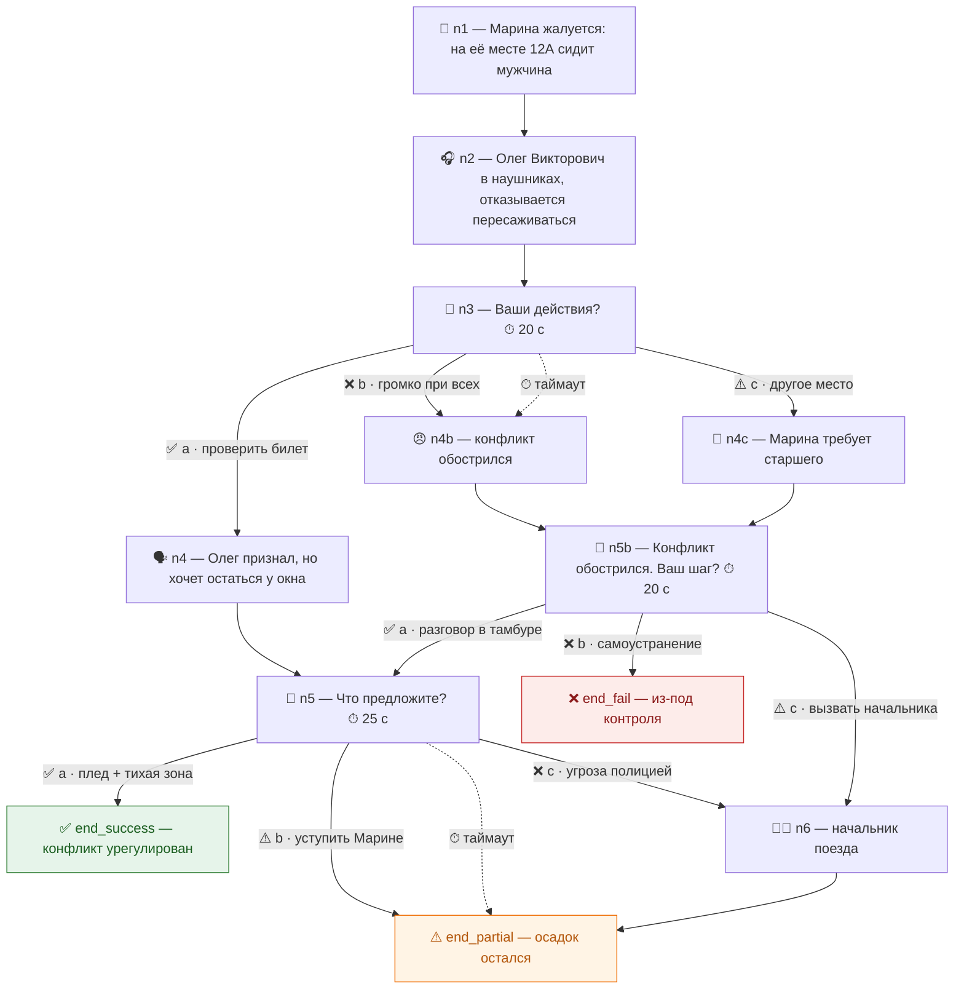

# User Flow и примеры игровых сценариев

## Роли

| Роль | Что делает |
|------|------------|
| **Проводник** (`employee`) | Проходит сценарии, турниры, специвенты; копит очки компетенций, уровень, достижения; соревнуется в рейтинге |
| **Руководитель** (`lead`) | Смотрит аналитику команды, запускает специвенты и турниры, управляет сценариями |
| **HR** (`admin`) | Экспортирует отчёты для HR-системы, работает с ИИ-ассистентом, правит справочники |

---

## Пользовательский сценарий: проводник

### 1. Онбординг и профиль
1. Сотрудник входит (`demo@m400.ru` / `demo123`) — JWT, доступ через web view или мессенджер.
2. На главной видит **маршрут-трек**: уровень («Проводник-новичок»), прогресс до следующей станции, очки компетенций.
3. В профиле — шкалы «Лояльность пассажира» и «Безопасность», освоение 6 компетенций (радар), «подтянуть» слабое направление.

### 2. Прохождение сценария
1. Выбирает сценарий из каталога или **рекомендованный** (система подбирает по слабым местам).
2. Читает ситуацию, на критических шагах **включается таймер** (10–30 с) с обратным отсчётом.
3. Принимает решение: выбор варианта, свободный ответ (оценивает ИИ) или **таймаут** (промедление — тоже решение, штраф по шкалам).
4. Каждое решение меняет **обе шкалы по-разному**; при `safety = 0` — критический инцидент и провал.
5. В конце — **экран разбора**: какие решения были неоптимальными, что следовало сделать и почему, как это повлияло на шкалы.
6. Начисляются **очки компетенций** (решения + шкалы + исход + множители режима), может повыситься уровень, открыться **достижения**.

### 3. Геймификация
- **Уровни** — 8 градаций от «Стажёра» до «Легенды магистрали».
- **Достижения** — 14 ачивок + трофеи турниров (common/rare/epic/legendary).
- **Лидерборд** — компания/депо/бригада, за неделю и за всё время; «ваше место» с отрывом до соседей.
- **Специвенты** — посреди дня внезапно приходит экстренная ситуация (сирена, голосовое сообщение, полноэкранный оверлей «Принять вызов»).
- **Турнир** — раз в неделю все отвечают на время; топ-10 получают ачивку и +100 к рейтингу.
- **Повышение квалификации** — сценарии следующей должности (проводник → старший → начальник поезда) с множителем ×1.5.

---

## Пользовательский сценарий: руководитель / HR

1. Открывает **дашборд**: активность команды, успешность по категориям, динамика безопасности, **частые ошибки**.
2. Видит карточки сотрудников «требуют внимания», готовность к повышению.
3. Запускает **специвент** для всех или выбранных проводников.
4. Управляет **турнирами** (создать, стартовать сейчас, финализировать).
5. Генерирует **черновик сценария ИИ** по ТЗ инструктора, редактирует и публикует.
6. Задаёт вопросы **ИИ-ассистенту** («покажи, у кого упала безопасность за месяц»).
7. Выгружает **отчёт в Excel/JSON** для HR-системы.

---

## Пример игрового сценария: «Чужое место»

**Категория:** конфликт · **Должность:** проводник · **Сложность:** 1 · **Таймеры:** 20–25 с
**Старт шкал:** лояльность 60, безопасность 80



**Легенда:** ✅ — оптимальное решение (BEST) · ⚠️ — допустимое (OK) · ❌ — ошибочное (BAD) · ⏱ — таймаут (промедление — тоже решение, штраф по шкалам)

На одной развилке решения влияют только на лояльность, на другой — на лояльность **и** безопасность. Исход зависит от доли оптимальных решений и финальных шкал, поэтому **однозначно «правильного» пути нет** — важны последствия.

## Другие сценарии пилота

| Сценарий | Категория | Суть |
|----------|-----------|------|
| Боль в груди на 300 км/ч | medical | Первая помощь, нитроглицерин опасен, связь с начальником поезда |
| Отказ кондиционера | technical | Эвакуация/снижение нагрузки, защита компрессора, Вова-механик |
| Чья это задача | teamwork | 5 ситуаций: кто отвечает — электромеханик/проводник/начальник |
| Задержка и целиакия | service | Премиальный сервис, пересадка, спецпитание |
| Специвент: без сознания | emergency | Экстренная ситуация с голосовым сообщением |
| Специвент: датчик дыма | emergency | Дым в туалете — действия по регламенту |
| Специвент: анафилаксия (EN) | emergency | EpiPen, работа на английском |

## Структура сценария (JSON-граф)

Сценарий — это граф узлов, хранимый в `scenarios.graph` и добавляемый без деплоя:

- `scene` — нарратив (кнопка «Далее»)
- `choice` — выбор из вариантов (`choices[]`), таймер, ветка `timeout`
- `input` — свободный ответ, оценка ИИ, ветвление по `branches[min_score]`
- `end` — финал с `outcome: success|partial|fail`

```json
{
  "start": "n1",
  "initial": {"loyalty": 60, "safety": 80},
  "nodes": {
    "n1": {"type": "scene", "text": "...", "next": "n2"},
    "n3": {"type": "choice", "timer": 20, "choices": [
        {"id": "a", "text": "...", "next": "n4", "quality": "best",
         "points": 20, "effects": {"loyalty": 5}, "feedback": "..."}
    ], "timeout": {"next": "n4b", "feedback": "...", "effects": {"loyalty": -10}}},
    "end_success": {"type": "end", "outcome": "success", "title": "...", "text": "..."}
  }
}
```